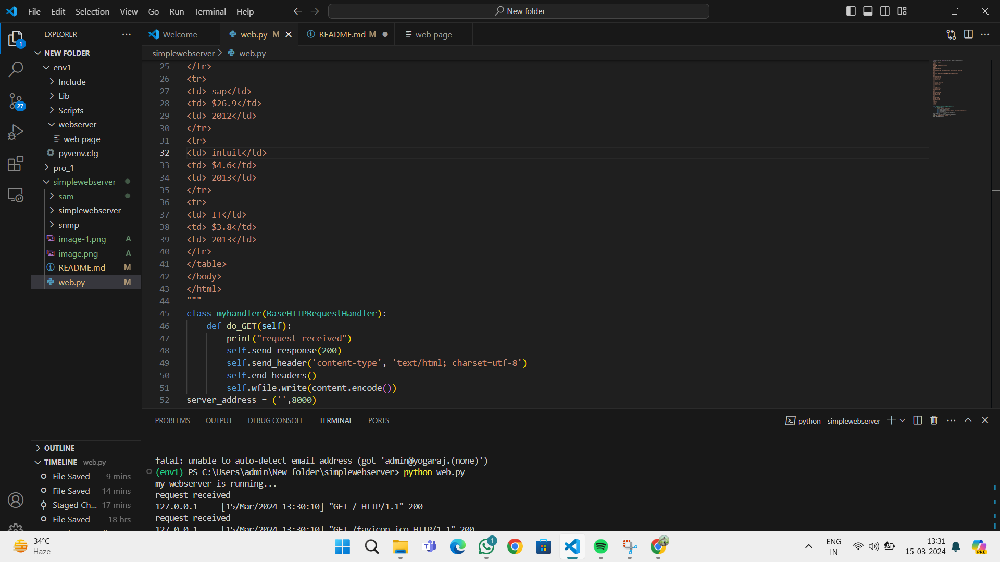

# EX01 Developing a Simple Webserver
## Date: 15/03/2024

## AIM:
To develop a simple webserver to serve html pages.

## DESIGN STEPS:
### Step 1: 
HTML content creation.

### Step 2:
Design of webserver workflow.

### Step 3:
Implementation using Python code.

### Step 4:
Serving the HTML pages.

### Step 5:
Testing the webserver.

## PROGRAM:
```
from http.server import HTTPServer, BaseHTTPRequestHandler
content = """
<!DOCTYPE html>
<html>
<head>
<title>My webserver</title>
</head>
<body>
<table border=2>
<tr>
<th>Company</th> <th>Revenue</th> <th>Financial Year</th>
</tr>
<tr>
<td>Micro Soft</td> <td>$9034</td> <td>2014</td>
</tr>
<tr>
<td> oracle</td>
<td> $37.1</td>
<td> 2013</td>
</tr>
<tr>
<td> Micro Soft</td>
<td> $86.6</td>
<td> 2014</td>
</tr>
<tr>
<td> sap</td>
<td> $26.9</td>
<td> 2012</td>
</tr>
<tr>
<td> intuit</td>
<td> $4.6</td>
<td> 2013</td>
</tr>
<tr>
<td> IT</td>
<td> $3.8</td>
<td> 2013</td>
</tr>
</table>
</body>
</html>
"""
class myhandler(BaseHTTPRequestHandler):
    def do_GET(self):
        print("request received")
        self.send_response(200)
        self.send_header('content-type', 'text/html; charset=utf-8')
        self.end_headers()
        self.wfile.write(content.encode())
server_address = ('',8000)
httpd = HTTPServer(server_address,myhandler)
print("my webserver is running...")
httpd.serve_forever()
```

## OUTPUT:


## RESULT:
The program for implementing simple webserver is executed successfully.
